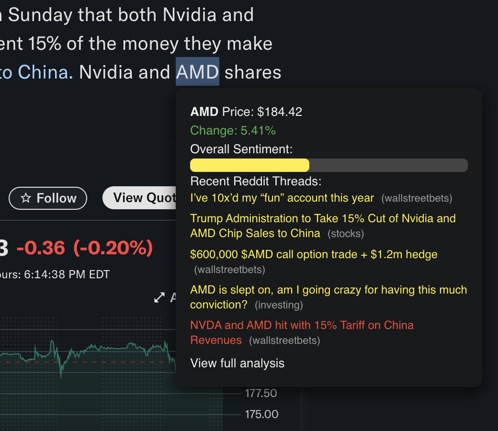
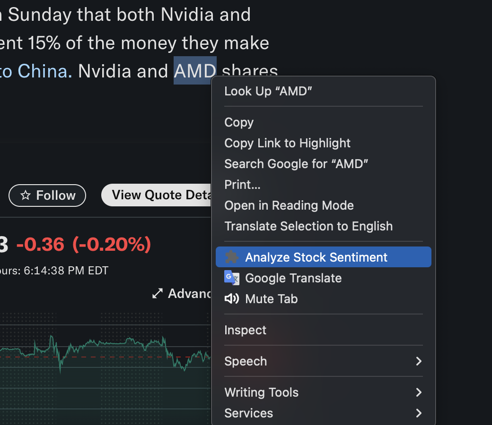

# Reddit Stock Sentiment Tracker 🚀

AI-powered Chrome Extension that analyzes stock-related Reddit threads and visualizes sentiment in real-time using an NLP model fine-tuned for **financial news**. Built with **JavaScript, Node.js, Hugging Face API**, and **Reddit & Finnhub APIs**.

---

## 📌 Features

- **Real-time Reddit Sentiment** - Scrapes the latest 5 relevant threads from subreddits like r/stocks, r/wallstreetbets, r/investing.
- **Financial NLP Model** - Uses [mrm8488/distilroberta-finetuned-financial-news-sentiment-analysis](https://huggingface.co/mrm8488/distilroberta-finetuned-financial-news-sentiment-analysis) for finance-specific sentiment scoring.
- **Stock Data** - Live price, change %, and historical info from [Finnhub](https://finnhub.io/).
- **Visual Sentiment Breakdown** - Color-coded bars: 🟢 Bullish (≥70) | 🟡 Neutral (40–69) | 🔴 Bearish (<40).
- **Context Menu Integration** - Right-click → *Analyze Stock Sentiment* for any selected ticker.
- **Secure Backend** - Keys stored in .env, backend handles API calls to avoid exposing secrets.

---

## 🛠 Tech Stack

### **Frontend (Chrome Extension)**
- Manifest V3
- Background service worker + content scripts
- HTML/CSS/JavaScript for UI & tooltip rendering

### **Backend**
- Node.js + Express
- Hugging Face Inference API
- Reddit API + OAuth2
- Finnhub API
- CORS-enabled for extension requests

---

## 📷 Screenshots

| Tooltip with Sentiment | Context Menu |
|------------------------|--------------|
|  |  |


---

## 🚀 Local Development

### **1. Clone the repo**

```bash
git clone https://github.com/YOUR_GITHUB_USERNAME/reddit-stock-sentiment-tracker.git
cd reddit-stock-sentiment-tracker
```

### **2. Backend Setup**

```bash
cd server
npm install
```

Create a `.env` in `/server` with:

```env
HF_TOKEN=your_huggingface_api_token
FINNHUB_KEY=your_finnhub_api_key
REDDIT_CLIENT_ID=your_reddit_client_id
REDDIT_CLIENT_SECRET=your_reddit_client_secret
REDDIT_USER_AGENT=your_app_user_agent
PORT=5000
```

Run:

```bash
node server.js
```

### **3. Frontend (Chrome Extension)**

- Go to `chrome://extensions`
- Toggle **Developer Mode**
- Click **Load Unpacked** and select the extension folder (`/extension` or `/`).
- Set `BACKEND_URL` in your JS files to `http://localhost:5000` for local testing.

---

## 🔒 Environment Variables

| Variable | Description |
|----------|-------------|
| HF_TOKEN | Hugging Face token (read access) |
| FINNHUB_KEY | Finnhub API key |
| REDDIT_CLIENT_ID | Reddit OAuth client ID |
| REDDIT_CLIENT_SECRET | Reddit OAuth client secret |
| REDDIT_USER_AGENT | App's user agent string |

---

## 📦 Build & Distribution

**Developer Mode Install**:
- Share unpacked folder with instructions to load in `chrome://extensions`.

**Production**:
- Deploy backend to [Heroku](https://www.heroku.com/), [Vercel](https://vercel.com/), or AWS.
- Update extension's `BACKEND_URL` to point to deployed backend.
- Pay $5 and publish on Chrome Web Store.

---

## 🤝 Contributing

Pull requests are welcome. For major changes, open an issue first to discuss what you'd like to change.

---

## 📜 License

MIT License © 2025

---

## ☕ Support

If you find this useful, you can [Buy Me a Coffee](https://www.buymeacoffee.com/YOURUSERNAME) to support development.
